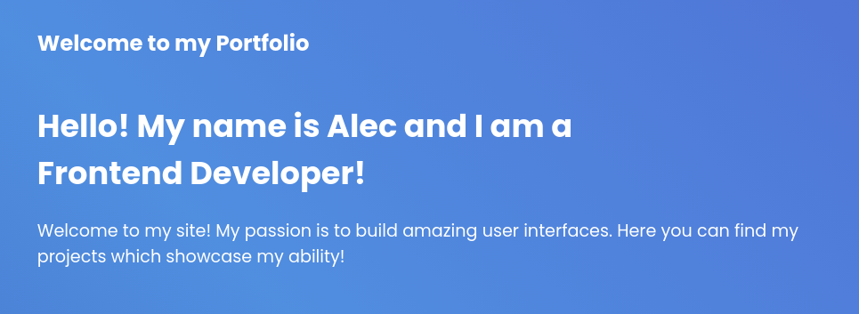
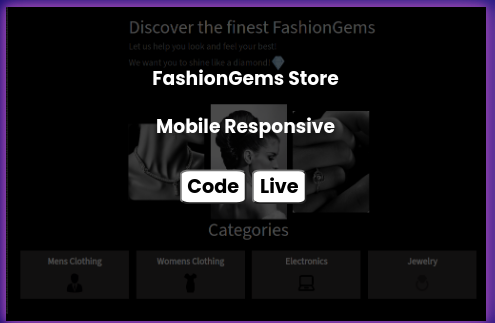
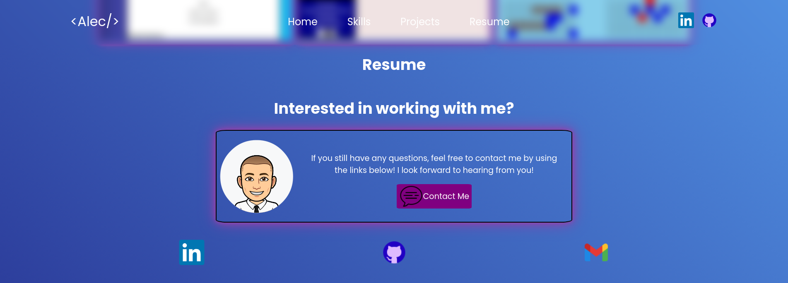
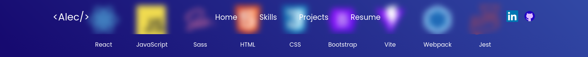
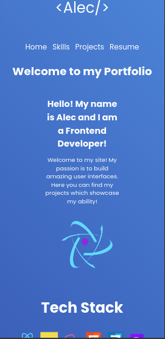

<h1>About This Project</h1> 
The goal of this project was to create a contemporary web developer portfolio that stands out. Hosting my top projects showcasing my frontend development skills, it also provides various ways for visitors to reach out to me. Incorporating animations such as fading and sliding elements, along with text with a typing animation, added an engaging touch. It was an enjoyable experience bringing this portfolio to life! 

<br> 

<h1>What I learned</h1>
    <ul>
   <li>Utilized React and state hooks for managing animations</li>
<li>Introduced to Intersection Observer objects, triggering animations when specific elements are in view</li>
<li>Structured styles using SASS/SCSS, assigning each component its dedicated stylesheet</li>
<li>Employed hover classes for displaying targeted elements</li>
<li>Implemented advanced CSS techniques to create intricate animations</li>
<li>Enhanced communication skills, persistence, and teamwork through collaboration with professional developers and fellow students</li>
    </ul>
 

 <h1>Build With</h1>

 
  
 
  
 


<h1>Getting Started</h1>

To get project cloned locally: git clone git@github.com:alecnissen/Personal-Portfolio-React.git

then ``` npm install ``` which will install all dependency's and packages.

<h1>Features</h1>

- Typing animation in welcome and name introduction text 



- React animation logo using pure CSS! The circles around the animation continously spin


- Tech stack icon row will have a fade in animation applied 


- When user hovers over a project, a hover class will be applied which displays project names with links to github and a live link.



- Resume section will slide in from the left, along with footer links at the bottom for inquires!. 



- Header is see through, making background elements blurry.



- Fully responsive, works on mobile and tablets




<h1>Acknowledgments</h1> Thank you to everyone within The Odin Project Curriculum from the bottom of my heart! Thank you to anyone who helped me in the discord channels. I promise to help others throughout this journey. 

<h1>Contact</h1>

Creator: Alec J Nissen 
<br>
E-Mail: alecnissen@yahoo.com
<br>
GitHub: https://github.com/alecnissen/Personal-Portfolio-React
<br>
Live Link: https://alecnissenportfolio.netlify.app
